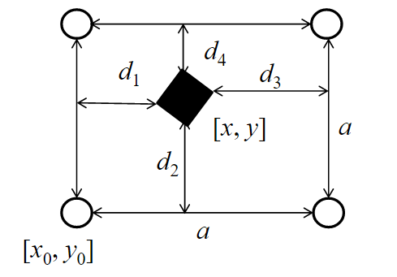
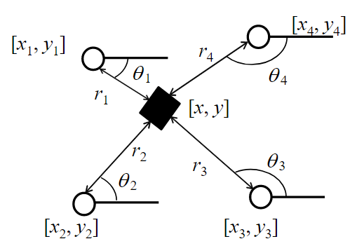

# Homework 10

11612232 黄旭

## Problem 1

### 1. Known landmark location and known associations

Since the location of the landmark is known, the EKF SLAM problem can be transfer to EKF location problem

State vector is 
$$
\mu = \begin{bmatrix} x & y \end{bmatrix}^T
$$
State transfer matrix is 
$$
A = \begin{bmatrix} 1 & 0 \\ 0 & 1 \end{bmatrix}
$$
Control vector is
$$
u = \begin{bmatrix} S_x & S_y \end{bmatrix}^T
$$
Control transfer matrix is
$$
B = \begin{bmatrix} 1 & 0 \\ 0 & 1 \end{bmatrix}
$$
So, the prediction part of EKF location is:
$$
\begin{align}
\bar\mu_t &= A\mu_{t-1} + Bu_t \\
\bar\Sigma_t &= A\Sigma_{t-1}A^T + Q
\end{align}
$$
where 
$$
Q = \begin{bmatrix} \sigma_{vx} & 0 \\ 0 & \sigma_{vy} \end{bmatrix}
$$

For the observation, the observation matrix is

$$
z = \begin{bmatrix} d_1 & d_2 & d_3 & d_4 \end{bmatrix}^T
$$
the observation state transfer function is
$$
h(\mu) = 
\begin{bmatrix}
1 & 0 \\
1 & 0 \\
0 & -1 \\
0 & -1 \\
\end{bmatrix}
\mu + 
\begin{bmatrix}
-x_0 \\
-y_0 \\
x_0 + a \\
y_0 + a \\
\end{bmatrix}
$$
Thus, the Jacobian matrix is
$$
H = 
\begin{bmatrix}
\frac{\partial h_1(\bar\mu)}{\partial x} & \frac{\partial h_1(\bar\mu)}{\partial y} \\
\frac{\partial h_2(\bar\mu)}{\partial x} & \frac{\partial h_2(\bar\mu)}{\partial y} \\
\frac{\partial h_3(\bar\mu)}{\partial x} & \frac{\partial h_3(\bar\mu)}{\partial y} \\
\frac{\partial h_4(\bar\mu)}{\partial x} & \frac{\partial h_4(\bar\mu)}{\partial y} \\
\end{bmatrix} =
\begin{bmatrix} 1 & 0 \\ 0 & 1 \\ -1 & 0 \\ 0 & -1 \end{bmatrix}
$$
So, the correction part of EKF location is:
$$
\begin{align}
K_t &= \bar\Sigma_tH^T(H\bar\Sigma_tH^T + R)^{-1} \\
\mu_t &= \bar\mu_t + K_t(z - h(\bar\mu_t)) \\
\Sigma_t &= (I - K_tH)\bar\Sigma_t
\end{align}
$$
where
$$
R = 
\begin{bmatrix} 
\sigma_{d1} & 0 & 0 & 0 \\
0 & \sigma_{d2} & 0 & 0 \\
0 & 0 & \sigma_{d3} & 0 \\
0 & 0 & 0 & \sigma_{d4} \\
\end{bmatrix}
$$

### 2. Unknown landmark location and known associations

For SLAM problem, the corresponding state vector is:
$$
\mu = \begin{bmatrix} x & y & x_0 & y_0 & a\end{bmatrix}^T
$$
State transfer matrix is 
$$
A = 
\begin{bmatrix} 
1 & 0 & 0 & 0 & 0 \\ 
0 & 1 & 0 & 0 & 0 \\
0 & 0 & 1 & 0 & 0 \\
0 & 0 & 0 & 1 & 0 \\
0 & 0 & 0 & 0 & 1 \\
\end{bmatrix}
$$
Control vector is
$$
u = \begin{bmatrix} S_x & S_y \end{bmatrix}^T
$$
Control transfer matrix is
$$
B = 
\begin{bmatrix}
1 & 0 \\
0 & 1 \\
0 & 0 \\
0 & 0 \\
0 & 0 \\
\end{bmatrix}
$$
So, the prediction part of EKF location is:
$$
\begin{align}
\bar\mu_t &= A\mu_{t-1} + Bu_t \\
\bar\Sigma_t &= A\Sigma_{t-1}A^T + Q
\end{align}
$$
where 
$$
Q = \begin{bmatrix} \sigma_{vx} & 0 \\ 0 & \sigma_{vy} \end{bmatrix}
$$
For the observation, the observation matrix is

$$
z = \begin{bmatrix} d_1 & d_2 & d_3 & d_4 \end{bmatrix}^T
$$
the observation state transfer function is
$$
h(\mu) = 
\begin{bmatrix}
1 & 0 & -1 & 0 & 0 \\
0 & 1 & 0 & -1 & 0 \\
-1 & 0 & 1 & 0 & 1 \\
0 & -1 & 0 & 1 & 1 \\
\end{bmatrix}
\mu
$$
Thus, the Jacobian matrix is
$$
H = 
\begin{bmatrix}
\frac{\partial h_1(\bar\mu)}{\partial x} & \frac{\partial h_1(\bar\mu)}{\partial y} & \frac{\partial h_1(\bar\mu)}{\partial x_0} & \frac{\partial h_1(\bar\mu)}{\partial y_0} & \frac{\partial h_1(\bar\mu)}{\partial a} \\
\frac{\partial h_2(\bar\mu)}{\partial x} & \frac{\partial h_2(\bar\mu)}{\partial y} & \frac{\partial h_2(\bar\mu)}{\partial x_0} & \frac{\partial h_2(\bar\mu)}{\partial y_0} & \frac{\partial h_2(\bar\mu)}{\partial a} \\
\frac{\partial h_3(\bar\mu)}{\partial x} & \frac{\partial h_3(\bar\mu)}{\partial y} & \frac{\partial h_3(\bar\mu)}{\partial x_0} & \frac{\partial h_3(\bar\mu)}{\partial y_0} & \frac{\partial h_3(\bar\mu)}{\partial a} \\
\frac{\partial h_4(\bar\mu)}{\partial x} & \frac{\partial h_4(\bar\mu)}{\partial y} & \frac{\partial h_4(\bar\mu)}{\partial x_0} & \frac{\partial h_4(\bar\mu)}{\partial y_0} & \frac{\partial h_4(\bar\mu)}{\partial a} \\
\end{bmatrix} =
\begin{bmatrix}
1 & 0 & -1 & 0 & 0 \\
0 & 1 & 0 & -1 & 0 \\
-1 & 0 & 1 & 0 & 1 \\
0 & -1 & 0 & 1 & 1 \\
\end{bmatrix}
$$
So, the correction part of EKF location is:
$$
\begin{align}
K_t &= \bar\Sigma_tH^T(H\bar\Sigma_tH^T + R)^{-1} \\
\mu_t &= \bar\mu_t + K_t(z - h(\bar\mu_t)) \\
\Sigma_t &= (I - K_tH)\bar\Sigma_t
\end{align}
$$
where
$$
R = 
\begin{bmatrix} 
\sigma_{d1} & 0 & 0 & 0 \\
0 & \sigma_{d2} & 0 & 0 \\
0 & 0 & \sigma_{d3} & 0 \\
0 & 0 & 0 & \sigma_{d4} \\
\end{bmatrix}
$$

### 3. Unknown landmark location and unknown associations

## Problem 2

### 1. Known landmark location and known associations

Since the location of the landmark is known, the EKF SLAM problem can be transfer to EKF location problem

State vector is 
$$
\mu = \begin{bmatrix} x & y & \theta \end{bmatrix}^T
$$
Control vector is
$$
u = \begin{bmatrix} \delta_{tran} & \delta_{rot1} & \delta_{rot2} \end{bmatrix}^T
$$
The Jacobian matrix is 
$$
G_t = 
\begin{bmatrix}
1 & 0 & -\delta_{tran}\sin(\theta + \delta_{rot1}) \\
0 & 1 & \delta_{tran}\cos(\theta + \delta_{rot1}) \\
0 & 0 & 1 \\
\end{bmatrix}
$$

So, the prediction part of EKF location is:
$$
\begin{align}
\bar\mu_t &= \mu_{t-1} + 
\begin{bmatrix}
\delta_{tran}\cos(\theta + \delta_{rot1}) \\
\delta_{tran}\sin(\theta + \delta_{rot1}) \\
\theta + \delta_{rot1} + \delta_{rot2} \\
\end{bmatrix} \\
\bar\Sigma_t &= G_t\Sigma_{t-1}G_t^T + Q
\end{align}
$$
where 
$$
\begin{bmatrix}
\sigma_x & 0 & 0 \\
0 & \sigma_y & 0 \\
0 & 0 & \sigma_{\theta} \\
\end{bmatrix}
$$

For the observation, the observation matrix is

$$
z = \begin{bmatrix} r_1 & \theta_1 & r_2 & \theta_2 & r_3 & \theta_3 & r_4 & \theta_4 \end{bmatrix}^T
$$
the observation state transfer function is
$$
h(\mu) = 
\begin{bmatrix}
\sqrt {q_1} \\
atan2((\bar y - y_1), (\bar x - x_1) \\
\sqrt {q_2} \\
atan2((\bar y - y_2), (\bar x - x_2) \\
\sqrt {q_3} \\
atan2((\bar y - y_3), (\bar x - x_3) \\
\sqrt {q_4} \\
atan2((\bar y - y_4), (\bar x - x_4) \\
\end{bmatrix}
$$
where
$$
q_1 = (\bar x - x_1)^2 + (\bar y - y_1)^2 \\
q_2 = (\bar x - x_2)^2 + (\bar y - y_2)^2 \\
q_3 = (\bar x - x_3)^2 + (\bar y - y_3)^2 \\
q_4 = (\bar x - x_4)^2 + (\bar y - y_4)^2 \\
$$

Thus, the Jacobian matrix is
$$
H = 
\begin{bmatrix}
\frac{\partial h_1(\bar\mu)}{\partial x} & \frac{\partial h_1(\bar\mu)}{\partial y} & \frac{\partial h_1(\bar\mu)}{\partial \theta} \\
\frac{\partial h_2(\bar\mu)}{\partial x} & \frac{\partial h_2(\bar\mu)}{\partial y} & \frac{\partial h_2(\bar\mu)}{\partial \theta} \\
\frac{\partial h_3(\bar\mu)}{\partial x} & \frac{\partial h_3(\bar\mu)}{\partial y} & 
\frac{\partial h_3(\bar\mu)}{\partial \theta} \\
\frac{\partial h_4(\bar\mu)}{\partial x} & \frac{\partial h_4(\bar\mu)}{\partial y} & \frac{\partial h_4(\bar\mu)}{\partial \theta} \\
\end{bmatrix} =
\begin{bmatrix}
\frac{\bar x - x_1}{\sqrt{q_1}} & \frac{\bar y - y_1}{\sqrt{q_1}} & 0 \\
-\frac{\bar y - y_1}{q_1} & \frac{\bar x - x_1}{q_1} & 0 \\
\frac{\bar x - x_2}{\sqrt{q_2}} & \frac{\bar y - y_2}{\sqrt{q_2}} & 0 \\
-\frac{\bar y - y_2}{q_2} & \frac{\bar x - x_2}{q_2} & 0 \\
\frac{\bar x - x_3}{\sqrt{q_3}} & \frac{\bar y - y_3}{\sqrt{q_3}} & 0 \\
-\frac{\bar y - y_3}{q_3} & \frac{\bar x - x_3}{q_3} & 0 \\
\frac{\bar x - x_4}{\sqrt{q_4}} & \frac{\bar y - y_4}{\sqrt{q_4}} & 0 \\
-\frac{\bar y - y_4}{q_4} & \frac{\bar x - x_4}{q_4} & 0 \\
\end{bmatrix}
$$
So, the correction part of EKF location is:
$$
\begin{align}
K_t &= \bar\Sigma_tH^T(H\bar\Sigma_tH^T + R)^{-1} \\
\mu_t &= \bar\mu_t + K_t(z - h(\bar\mu_t)) \\
\Sigma_t &= (I - K_tH)\bar\Sigma_t
\end{align}
$$
where
$$
R = 
\begin{bmatrix} 
\sigma_{d1} & 0 & 0 & 0 \\
0 & \sigma_{d2} & 0 & 0 \\
0 & 0 & \sigma_{d3} & 0 \\
0 & 0 & 0 & \sigma_{d4} \\
\end{bmatrix}
$$

### 2. Unknown landmark location and known associations

State vector is
$$
\mu = \begin{bmatrix}x & y & \theta & x_1 & y_1 & x_2 & y_2 & x_3 & y_3 & x_4 & y_4 \end{bmatrix}^T
$$
The Jacobian matrix is
$$
G_t = I + F_x^T
\begin{bmatrix}
0 & 0 & - \delta_{tran}\sin(\theta + \delta_{rot1}) \\
0 & 0 &  \delta_{tran}\cos(\theta + \delta_{rot1}) \\
0 & 0 & 0 \\
\end{bmatrix}
F_x
$$
where
$$
F_x = 
\begin{bmatrix}
1 & 0 & 0 & 0 & 0 & 0 & 0 & 0 & 0 & 0 & 0 \\
0 & 1 & 0 & 0 & 0 & 0 & 0 & 0 & 0 & 0 & 0 \\
0 & 0 & 1 & 0 & 0 & 0 & 0 & 0 & 0 & 0 & 0 \\
\end{bmatrix}
$$
The prediction part of EKF is
$$
\begin{align}
\bar\mu_t &= \mu_{t-1} + F_x^T
\begin{bmatrix}
0 & 0 & \delta_{tran}\cos(\theta + \delta_{rot1}) \\
0 & 0 & \delta_{tran}\sin(\theta + \delta_{rot1}) \\
0 & 0 & 0 \\
\end{bmatrix} \\
\bar\Sigma_t &= G_t\Sigma_{t-1}G_t^T + F_x^TQF_x
\end{align}
$$
where
$$
Q = 
\begin{bmatrix}
\sigma_x & 0 & 0 \\
0 & \sigma_y & 0 \\
0 & 0 & \sigma_{\theta} \\
\end{bmatrix}
$$
For the observation, the observation matrix is
$$
z = \begin{bmatrix} r_1 & \theta_1 & r_2 & \theta_2 & r_3 & \theta_3 & r_4 & \theta_4 \end{bmatrix}^T
$$
the observation state transfer function is
$$
h(\mu) = 
\begin{bmatrix}
\sqrt {q_1} \\
atan2((\bar y - y_1), (\bar x - x_1) \\
\sqrt {q_2} \\
atan2((\bar y - y_2), (\bar x - x_2) \\
\sqrt {q_3} \\
atan2((\bar y - y_3), (\bar x - x_3) \\
\sqrt {q_4} \\
atan2((\bar y - y_4), (\bar x - x_4) \\
\end{bmatrix}
$$
where
$$
q_1 = (\bar x - x_1)^2 + (\bar y - y_1)^2 \\
q_2 = (\bar x - x_2)^2 + (\bar y - y_2)^2 \\
q_3 = (\bar x - x_3)^2 + (\bar y - y_3)^2 \\
q_4 = (\bar x - x_4)^2 + (\bar y - y_4)^2 \\
$$
where $j$ is the index of the landmark

for each observation
$$
F_{x, j}=\begin{bmatrix} 
\begin{array}{ccccccccc}{1} & {0} & {0} & {0 \cdots 0} & {0} & {0} & {0} & {0 \cdots 0} \\ {0} & {1} & {0} & {0 \cdots 0} & {0} & {0} & {0} & {0 \cdots 0} \\ {0} & {0} & {1} & {0 \cdots 0} & {0} & {0} & {0} & {0 \cdots 0} \\ {0} & {0} & {0} & {0 \cdots 0} & {1} & {0} & {0} & {0 \cdots 0} \\ {0} & {0} & {0} & {0 \cdots 0} & {0} & {1} & {0} & {0 \cdots 0} \\ {0} & {0} & {0} & {\underbrace{0 \cdots 0}_{3 j-3}} & {0} & {0} & {1} & {\underbrace{0 \cdots 0}_{N-3 j}}\end{array}
\end{bmatrix}
$$

$$
H_i = \frac{1}{q} 
\begin{bmatrix}
\begin{array}{ccccc}{-\sqrt{q} \delta_{x}} & {-\sqrt{q} \delta_{y}} & {0} & {+\sqrt{q} \delta_{x}} & {\sqrt{q} \delta_{y}} \\ 
{\delta_{y}} & {-\delta_{x}} & {-q} & {-\delta_{y}} & {+\delta_{x}}\\ \end{array}
\end{bmatrix}F_j
$$

$$
H = \begin{bmatrix}H \\ H_i\end{bmatrix}
$$

So, the correction part of EKF location is:
$$
\begin{align}
K_t &= \bar\Sigma_tH^T(H\bar\Sigma_tH^T + R)^{-1} \\
\mu_t &= \bar\mu_t + K_t(z - h(\bar\mu_t)) \\
\Sigma_t &= (I - K_tH)\bar\Sigma_t
\end{align}
$$
where
$$
R = 
\begin{bmatrix} 
\sigma_{d1} & 0 & 0 & 0 \\
0 & \sigma_{d2} & 0 & 0 \\
0 & 0 & \sigma_{d3} & 0 \\
0 & 0 & 0 & \sigma_{d4} \\
\end{bmatrix}
$$
###

### 3. Unknown landmark location and unknown associations

